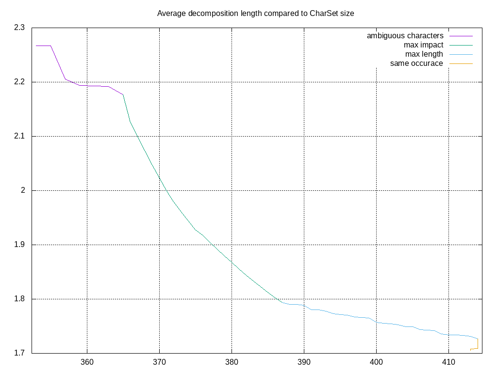

# CJK-decomposition

The decomposer can be used to split Chinese, Japanese (Kanji) or Korean (Hanja) characters into smaller components.
This mapping from original character to smaller components is called "decomposition".
The goal is to have a decomposition of each character into smaller components, whereas we only allow decompositions that are part of the actual unicode and are storeable by UTF-8 coding

As decomposition basis we use the 'ids.txt', which is a copy of https://github.com/cjkvi/cjkvi-ids/blob/master/ids.txt.

# Building
```
git clone https://github.com/gundramleifert/CJK-decomposition.git
cd CJK-decomposition
mvn install
```
# Dependencies
* git
* maven
* gnuplot

For Ubuntu:
```
sudo apt-get install git maven gnuplot
```
# Usage
It can be used as command-line tool or as library in java. For the command line see these examples:
```
#to see the help and all parameters
java -jar target/CJK-decomposition-1.0-SNAPSHOT-jar-with-dependencies.jar --help
# to use the example-file in the resources set args = ?
java -jar target/CJK-decomposition-1.0-SNAPSHOT-jar-with-dependencies.jar -p -u -d -o decomposition.txt -l leaves.txt ?
# to add own files
java -jar target/CJK-decomposition-1.0-SNAPSHOT-jar-with-dependencies.jar -p -u -d -o decomposition.txt -l leaves.txt <file1> <file2>
# to search for text files in a folder
java -jar target/CJK-decomposition-1.0-SNAPSHOT-jar-with-dependencies.jar -p -u -d -o decomposition.txt -l leaves.txt `find /path-to-files -name "*.txt"`
```

# Algorithm to decompose characters
* for each character a direct decomposition is loaded
* we apply the decomposition recursively to each character
* at the end, each character has a final decomposition, which is a kind of decomposition-tree
* We take the leaves of the tree as raw decomposition
* we truncate the tree as long as the leaves are valid UTF-8 codes or until the character is empty (this only happens, if the character itself and its decomposition variants have no UTF-8 code)
* the leaves (which are UTF-8 codes) are the basis components (we call them atoms) of the mapping
* this set of leaves is called 'CharSet'.

# Algorithm to minimize decomposition length (reduce decomposition)
In CJK languages there are characters that occure very often. For these characters it makes sense, to define them as leaves (if they have a valid UTF-8 code) and therefore reduce the decomposition length of characters:
This method can only work for a given text resource, for which we can optimize the CharSet. The goal is to make some characters into leaves so that the average decomposition length of a character is reduced.

* for a given text resource count the number of occurance of all characters and recursively all decomposition parts
* do __ambiguous characters__: (make map "decomposition -> root-character" distinct)
    * find character-pairs which have the same decomposition
    * turn both characters into leaves
    * repeat until no more character-pairs are found
* do __max impact__: (reduce average length)
    * for each character we calculate 'count*(length-1)' which is a score for how much it would reduce the text decomposition length.
    * we define the character with maximal score as new leaf.
    * repeat until the reduction gained by a new leaf is too small.
* do __max length__: (reduce length of all decompositions to a maximal value)
    * find root-character which occures in the text resource with the largest decomposition length
    * find all character in the decomposition tree that makes length of the root-character <= maximal value
    * we define the character with maximal 'count*(length-1)' as new leaf
    * repeat until each root-character has a decomposition <= maximal value
* do __same occurance__: (make characters with single-occurance of one leaf to leaf itself)
    * search for a valid character which has a leaf with the same number of occurance
    * turn character into leaf => CharMap stays same size or gets lower, but decomposition lenght decreases
    * repeat until no more such characters are found

# Example
if you run
```
java -jar target/CJK-decomposition-1.0-SNAPSHOT-jar-with-dependencies.jar -p -u -i -m 5 -o decomposition.txt -l leaves.txt ?
```
The plot looks like that (see the four reduction steps described before):

The file __decompositions.txt__ contains the 1608 raw characters, its decomposed version and the full decomposition
```
[...]
事	事	事
能	厶⺆冫匕匕	⿰⿱厶⿵⺆冫⿱⿺乚丿⿺乚丿
䏍	厶⺆冫	⿱厶⿵⺆冫
𫧇	匕匕	⿱⿺乚丿⿺乚丿
会	人二厶	⿱人⿱⿱一一厶
反	反	⿸𠂆又
[...]
```
The file __leaves.txt__ contains the 416 characters defined as leaves.
```
[...]
[ U+06587 '文' len= 1/ 4 (occurance=  19/ 222) leaf=true valid=true] '文'=>'⿱⿱丶一⿻丿乀'
[ U+06535 '攵' len= 1/ 1 (occurance=   0/ 216) leaf=true valid=true] '攵'=>'攵'
[ U+05C14 '尔' len= 1/ 2 (occurance=   2/ 209) leaf=true valid=true] '尔'=>'⿱𠂊小'
[ U+00039 '9' len= 1/ 1 (occurance= 192/ 192) leaf=true valid=true] '9'=>'9'
[ U+09A6C '马' len= 1/ 1 (occurance= 146/ 187) leaf=true valid=true] '马'=>'马'
[ U+08279 '艹' len= 1/ 2 (occurance=   0/ 184) leaf=true valid=true] '艹'=>'⿻十丨'
[...]
```

# Decomposition variants
there are 2 variant how a decomposition can be done:
1. The CharSet also contians character, which have no UTF-8 code. This makes the decomposition a bit easier, but the CharSet is no valid UTF-8 code.
2. For the decomposition we ignore all Ideographic Description Characters. This reduces the average length of the decomposition by a factor of ~30%, but makes it (almost) impossible to remap decomposition to a character.


for other (potentually better) mappings see
- https://github.com/cjkvi/cjkvi-ids
- https://github.com/chise/isd
- https://github.com/kawabata/ids


